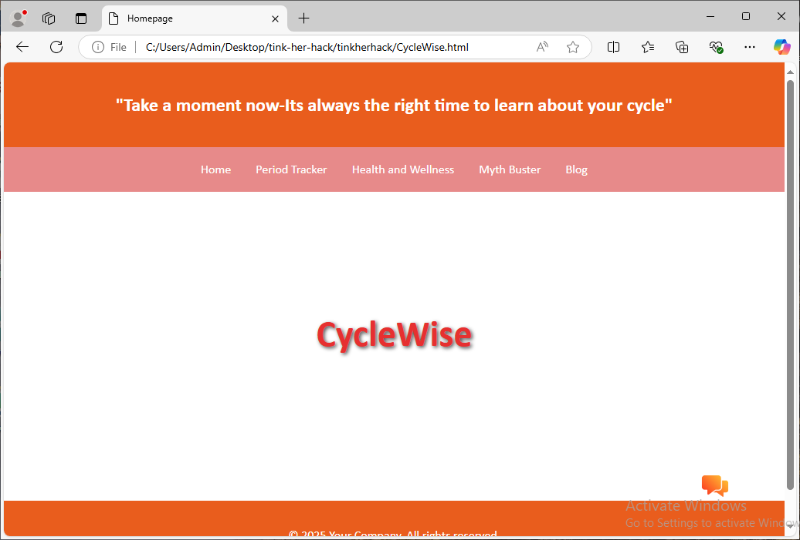
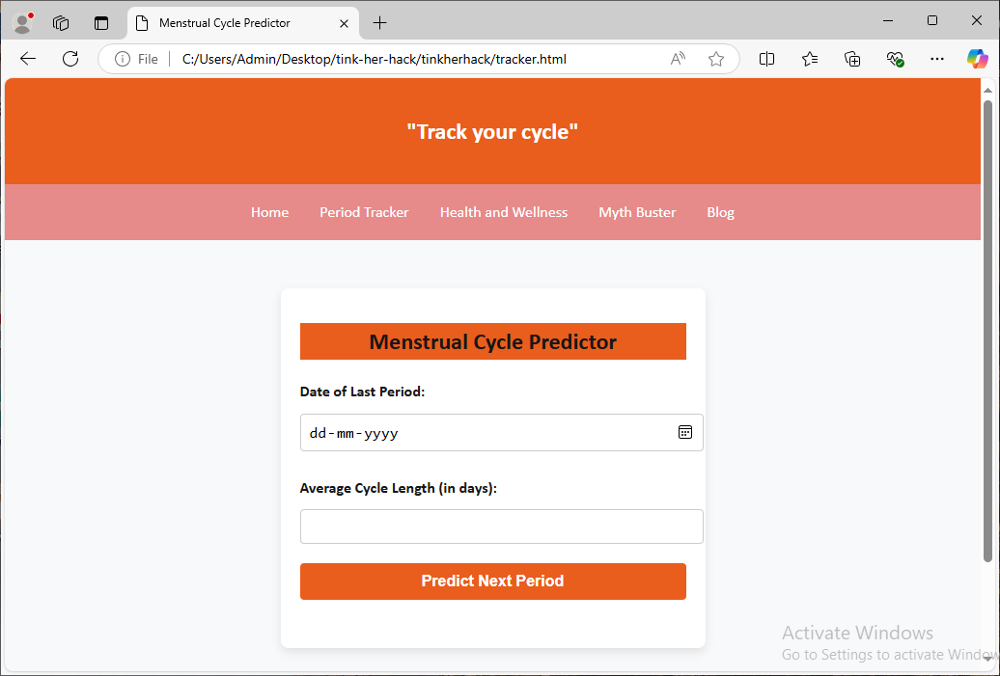
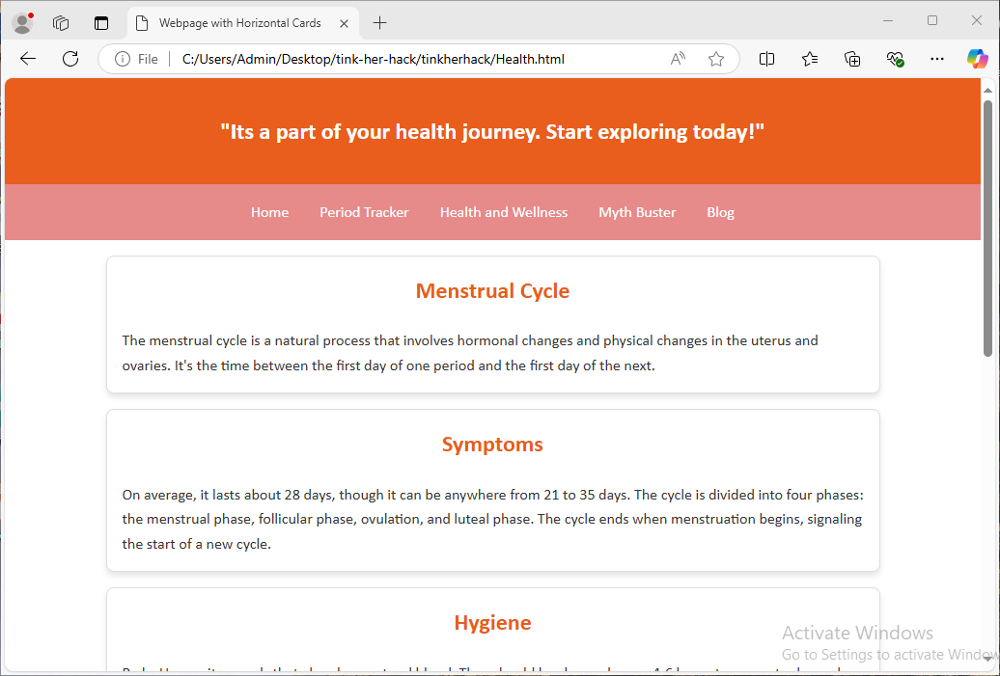
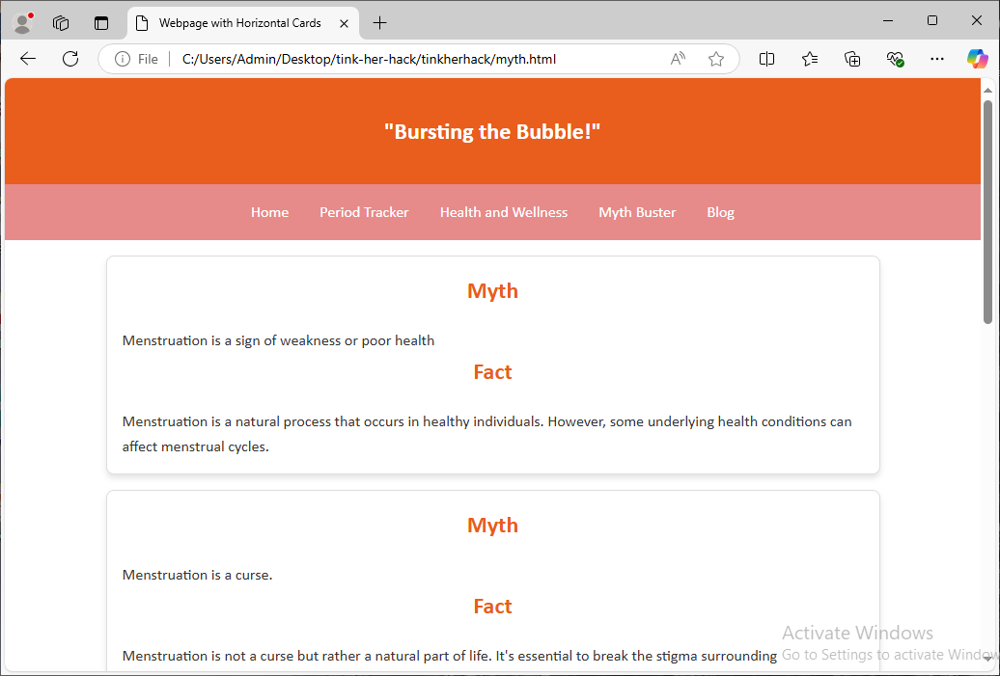
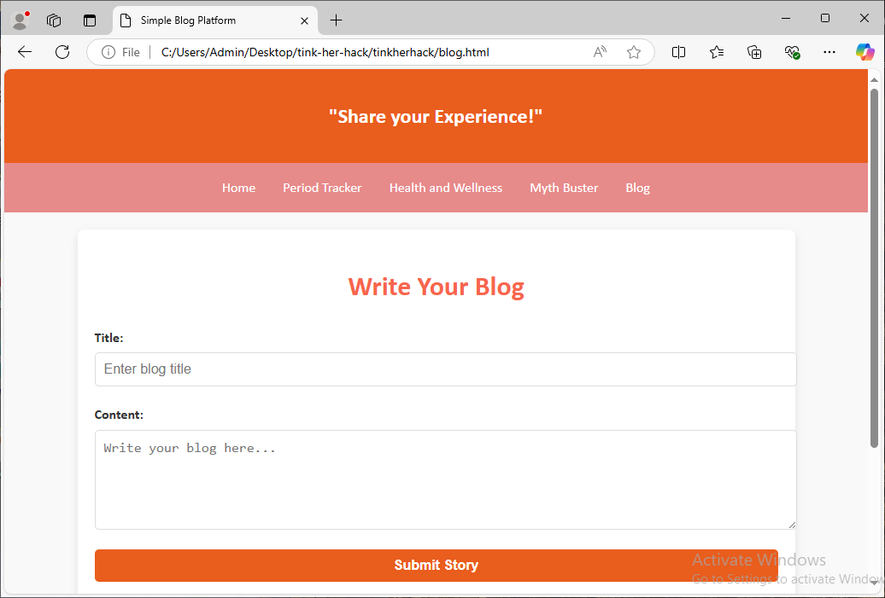
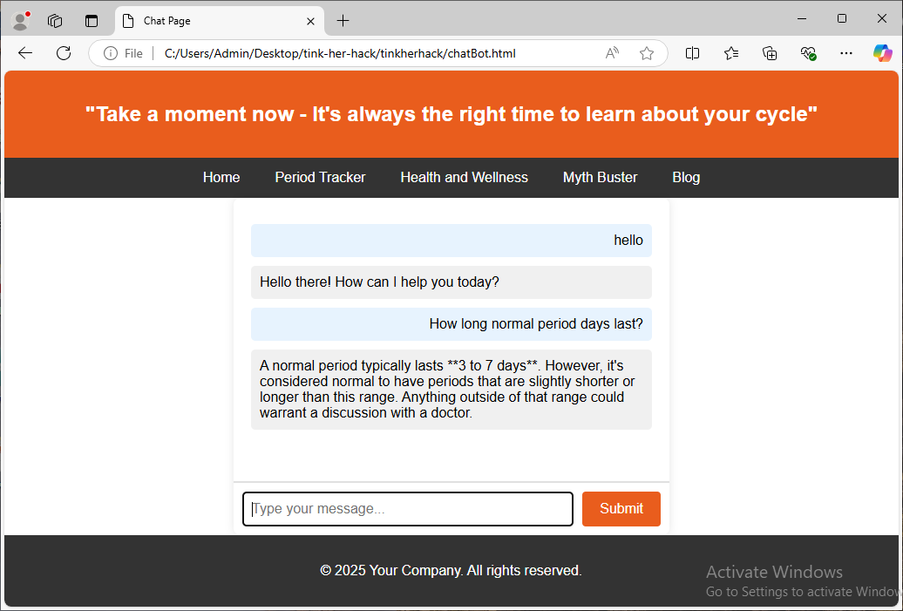

# tinkher_hack
Project Name: CycleWise

Our idea addresses the problem of lack of menstrual health awareness. Our aim is to educate individuals about menstrual health regarding hygiene practices, symptom management, health risks and  offer a customizable period tracker to help users monitor their menstrual cycles and a chatbot to clear your doubts.

Team Name: Code Crackers

Team Members:
Member 1: Navyasree A J - TKM COLLEGE OF ENGINEERING
Member 2: Fathima Fasila M - TKM COLLEGE OF ENGINEERING

Hosted Project Link:<a href="https://tinkherhack-8zbl.vercel.app/">link</a>

Project Description:
Our project is a web application which helps the user to track period cycle. The main features of this app includes: a period tracker, chatbot, health and wellness information, a myth buster and a blog page where the users can share their experiences. The period tracker helps the user to predict the next period date and also provides menstrual health awareness. The users can also use the chatbot to interact and clear their doubts regarding menstrual cycle. 

The Problem statement:
Many women struggle to keep track of their menstrual cycles, leading to unexpected periods and increased stress. 

The Solution:
Our solution includes a period tracker which uses the previous period date and average cycle length to predict the next period date. Also it provides awareness regarding menstrual health, hygiene, symptoms, nutrition and pain relief.

Technical Details
Technologies/Components Used
For Software:

Languages Used:
HTML
CSS
JavaScript
Framework Used:
Visual Studio Code

This is the homepage of the web appliaction which has its name and links to other pages.

Tracker page collects data regarding the last period date and average cycle length to predict the next period date.

This page provides awareness regarding menstrual cycle, symptoms, nutrition and pain relief.

This page deals with many misconceptions regarding menstruation by busting the myths.

Blog page allows the users to share their thoughts on periods.

An interactive way to clear doubts regarding menstruation.

Project Demo
Video
<a href = "https://drive.google.com/file/d/1unJW-faYWGvBzrGGDu88Ws73BblTCZNC/view?usp=sharing">Video Link</a> 

The video demonstrates the user interface and different functionalities of the web application.

Team Contributions
Navyasree A J: Blog page, Homepage, css stylesheet, chatbot
Fathima Fasila M: Health and Wellness page, Myth Buster page, Period Tracker, chatbot

